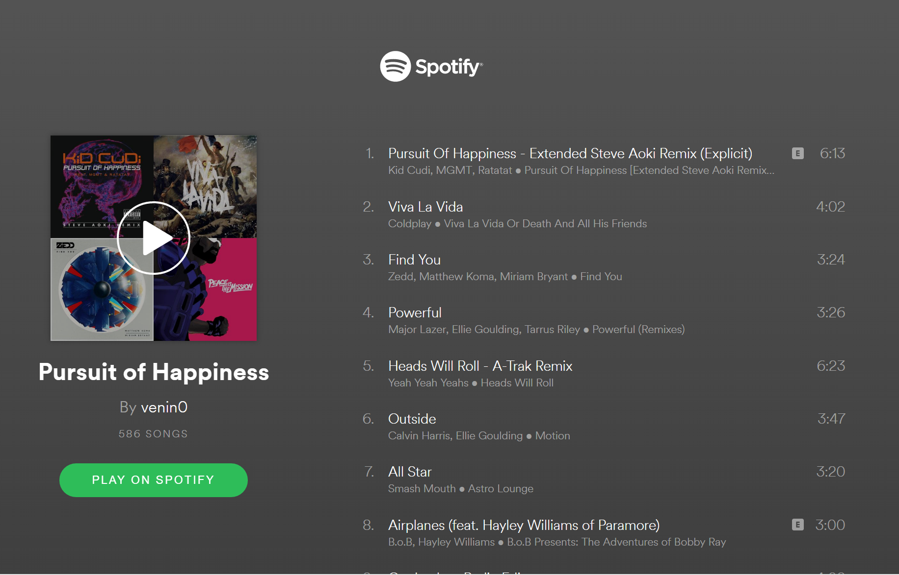

#  SongViber

> **"Your face picks the playlist. Your mood sets the vibe."**

[](https://developer.mozilla.org/en-US/docs/Web/JavaScript)
[](https://nodejs.org)
[](https://developer.spotify.com)
[](https://azure.microsoft.com)
[](LICENSE)
[]()

---

[🚀 Features](#-features) • [🧬 How it Works](#-how-it-works) • [🛠 Setup](#-installation--setup) • [📁 Project Structure](#-project-structure) • [🎭 Supported Moods](#-supported-moods) • [👥 Author](#-author)

---

## 🧭 The Problem

Finding the right music for your mood is harder than it sounds. Scrolling through playlists, searching for vibes, skipping tracks — it wastes time when all you want is music that matches how you feel right now.

**SongViber** eliminates the search entirely. Just show your face — the app reads your emotion using Microsoft Azure's Cognitive Services and instantly pulls a Spotify playlist that matches your mood. No input needed. No scrolling. Just music.

---

## 🚀 Features

- Real-time facial expression detection via webcam
- Mood classification using Microsoft Azure Face API
- Automatic Spotify playlist recommendation based on detected emotion
- Supports multiple moods — happy, sad, angry, surprised, and more
- Clean and minimal web interface
- Random playlist selection per mood for variety on repeat use

---

## 🧬 How it Works

```
📷 Webcam Capture
        │
        ▼
🧠 Microsoft Azure Face API
        │  Analyzes facial expression
        │  Returns emotion scores (happy, sad, angry, surprised...)
        │  Picks dominant emotion
        ▼
🎵 Spotify API
        │  Maps emotion → playlist search query
        │  Fetches matching playlists
        │  Returns a random playlist from results
        ▼
🎧 User gets a mood-matched Spotify playlist instantly
```

---

## 🏗 Architecture

| Component | Technology | Role |
|---|---|---|
| **Frontend** | HTML/CSS/JavaScript | Webcam capture, UI, result display |
| **Backend** | Node.js | API orchestration, request handling |
| **Emotion Detection** | Microsoft Azure Face API | Facial expression analysis |
| **Music** | Spotify Web API | Playlist search and recommendation |

---

## 📁 Project Structure

```
songviber/
├── demo/
│   ├── Happy.jpg
│   ├── HappyResult.png
│   ├── sad.jpg
│   ├── sadResult.png
│   ├── angry.jpg
│   └── angryResult.png
│
├── public/
│   ├── index.html
│   ├── style.css
│   └── script.js
│
├── server.js
├── package.json
└── README.md
```

---

## 🛠 Installation & Setup

### Prerequisites
- Node.js 18+
- Microsoft Azure account (free tier works)
- Spotify Developer account (free)

---

### Step 1 — Clone the Repository

```bash
git clone https://github.com/yourusername/SongViber.git
cd SongViber
```

---

### Step 2 — Get Your API Keys

**Microsoft Azure Face API:**
1. Go to [portal.azure.com](https://portal.azure.com)
2. Create a new **Face API** resource (free tier available)
3. Copy your **API Key** and **Endpoint**

**Spotify API:**
1. Go to [developer.spotify.com](https://developer.spotify.com/dashboard)
2. Create a new app
3. Copy your **Client ID** and **Client Secret**

---

### Step 3 — Configure Environment Variables

Create a `.env` file in the root folder:

```env
AZURE_FACE_API_KEY=your_azure_key_here
AZURE_FACE_API_ENDPOINT=your_azure_endpoint_here
SPOTIFY_CLIENT_ID=your_spotify_client_id
SPOTIFY_CLIENT_SECRET=your_spotify_client_secret
```

---

### Step 4 — Install and Run

```bash
npm install
npm start
```

Open your browser at `http://localhost:3000`

---

## 🎭 Supported Moods

| Emotion | Playlist Vibe |
|---|---|
| 😄 Happy | Upbeat, pop, feel-good hits |
| 😢 Sad | Chill, lo-fi, melancholic |
| 😠 Angry | Metal, intense, high energy |
| 😲 Surprised | Party, hype, random mix |
| 😐 Neutral | Ambient, study, background |

---

## 📸 Screenshots

### Happy



### Sad


### Angry


---

## 🔮 Future Improvements

- Support for uploaded images in addition to webcam
- Blended mood detection — mix playlists when emotions are close
- Spotify OAuth login for personalized recommendations
- Save mood history and track emotional patterns over time
- Mobile app version

---

## 👥 Author

**Aarjav Mukkirwar**
Full Stack Developer

---

## 📄 License

This project is licensed under the MIT License.

---

*"Don't pick a playlist. Let your face do it."*
**— Aarjav Mukkirwar**
